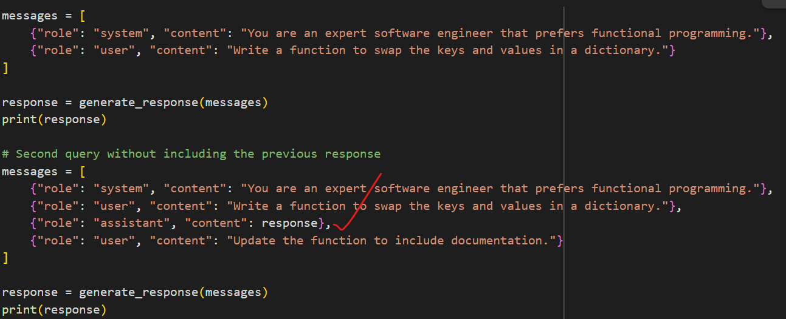

[Instructors gihub repo] (https://github.com/nordquant/mcp-course)

### Environment setup

We will use UV as package manager for Python

```
pip install uv
```

- To collect all dependencies used in venv

```
pip freeze > requirements.py
```

- To create virtual env with uv

```
uv virtualenv .venv
```

We will use pyproject.toml to specify dependencies.

- To install dependencies:

```
uv sync
```

- To add new dependency:

```
uv add openai
```

- To activate virtual env

```
# On Windows
.venv\Scripts\activate

# If gitbash
source .venv/Scripts/activate
```

- To run a script

```
uv run main.py
```

---

#### MCP architecture

- MCP host: Programs that want to access MCP services like Claude or Cursor
- MCP client: The client module that maintain connection between host and server
- MCP protocol: The language MCP clients and servers use for communication and data passing
- MCP server: Server applications that expose functionalities for LLMs through MCP protocol

#### MCP functionalities

- Tool use, @mcp.tool()
- Resources: Provide LLM with files and assets, @app.list_resouces(), @app.read_resource()
- Prompts: Provide pre-created prompts

Partially supported features:

- Roots: Define which resources to use with MCP
- Sampling: Classic LLM next token prediction service

---

### To add MCP server in Claude desktop

```
{
  "mcpServers": {
    "zapier-mcp": {
      "command": "npx",
      "args": [
        "mcp-remote",
        "<<<Paste the Zapier URL from zapier.com here, something like https://mcp.zapier.com/api/mcp/a/11353467/mcp>>>"
      ]
    }
  }
}
```

## Pydantic

Pydantic is a Python library for data validation and settings management that leverages Python's type annotations. It allows you to define data models using Python classes and automatically checks that any input data matches the structure and types you declare. At its core, Pydantic turns standard type hints into runtime validation rules, reducing manual code for validating and parsing data

### Agentic Interaction pattern

- Flipped interaction pattern (agent asks one question at a time and based on it agents reacts)
  Ask me question one at a time to gather enough information to do xyz. Ask me first question.
- Agent loop
  Human kicks off goal, then agent sets up and executes a set of instructions.
  (prompt -> Response -> Action)
  
  Construct prompt -> generate prompt -> parse prompt -> execute action
  -> convert result to string -> continue loop?
- [LiteLLM](https://github.com/BerriAI/litellm)
- [Collab NB] (https://colab.research.google.com/drive/10HP3q4jgEO7ONbJNBk9Vj1zuFEv1UCGx)
  response.choices[0].message.content
- Role:
  {"role": "", "content": ""}
  system: Provides the model with initial instructions, rules, or configuration for how it should behave throughout the session. This message is not part of the “conversation” but sets the ground rules or context
  user: Represents input from the user. This is where you provide your prompts, questions, or instructions.
  assistant: Represents responses from the AI model. You can include this role to provide context for a conversation that has already started or to guide the model by showing sample responses. These messages are interpreted as what the “model” said in the past.
- System prompts
  You are an expert software engineer that writes clean functional code. You always document your functions.

## Memory

- When we are building an Agent, we need it to remember its actions and the result of those actions. For example, if it tries to create a calendar event for a meeting and the API call fails due to an incorrect parameter value that it provided, we want it to remember that the API call failed and why. This way, it can correct the mistake and try again. If we have a complex task that we break down into multiple steps, we need the Agent to remember the results of each step to ensure that it can continue the task from where it left off. Memory is crucial for Agents.
  

## Quasi-agent

- Prompt Chaining: Breaking complex tasks into sequential steps makes them more manageable.
- Context Management: Carefully controlling what the LLM sees helps maintain focus and consistency.
- Output Processing: Having robust ways to extract and clean LLM output is crucial.
- Progressive Enhancement: Building features iteratively (code → docs → tests) creates better results than trying to do everything at once.

## Template prompting pattern


## Two ways of handling AI / environment interface issue

- Prompt engineering + parsing
- LLM that support function calling

## GAIL - Goals, Tools / Action, Information, Language


## Tool / Action description

tool_name - Tool description

## Tool use outcome


Error message should be meaningful for agents to figure it out.

```
{
  "tool_name": "read_file",
  "description": "Reads the content of a specified file.",
  "parameters": {
    "type": "object",
    "properties": {
      "file_path": { "type": "string" }
    },
    "required": ["file_path"]
  }
}
```

By providing a JSON Schema for each tool:

- The AI can Recognize the tool’s purpose.
- The AI / Environment interface can validate input parameters before execution.

Agent response:

```
{
  "tool_name": "read_file",
  "args": {
    "file_path": "src/file.py"
  }
}
```
